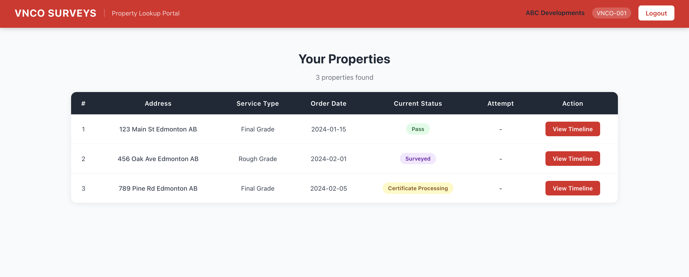
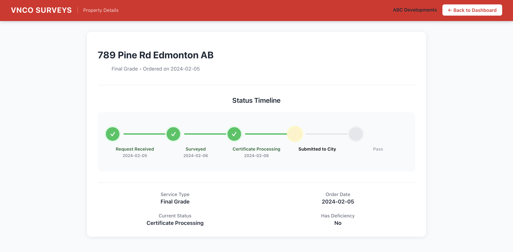
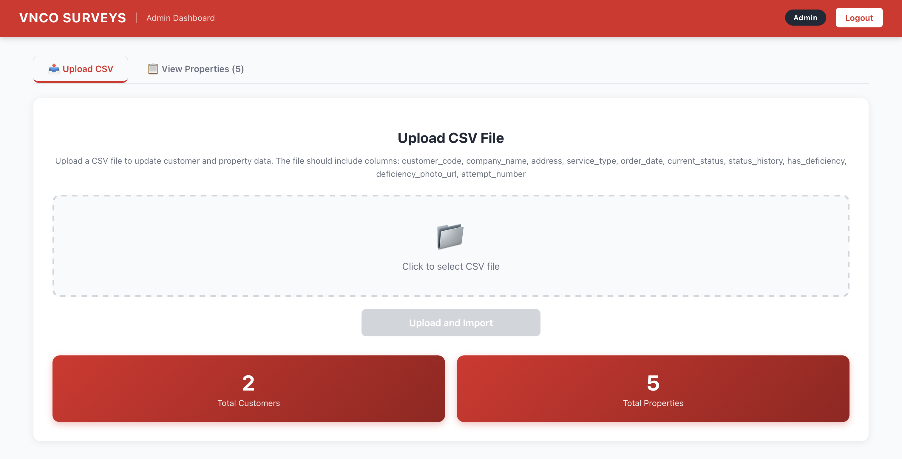

<!-- Improved compatibility of back to top link -->
<a id="readme-top"></a>

<!-- PROJECT SHIELDS -->
[![MIT License][license-shield]][license-url]

<!-- PROJECT LOGO -->
<br />
<div align="center">
  <a href="https://vncosurveys.com">
    
  </a>

<h3 align="center">VNCO Property Lookup Portal</h3>

  <p align="center">
    Production property tracking system for lot grading certificates
    <br />
    Built for VNCO SURVEYS - Edmonton land surveying company
    <br />
    <br />
    🔗 <strong><a href="https://portal.vncosurveys.com">Live Demo: portal.vncosurveys.com</a></strong>
    <br />
    <em>Currently in production use by construction companies</em>
  </p>
</div>

<!-- TABLE OF CONTENTS -->
<details>
  <summary>Table of Contents</summary>
  <ol>
    <li><a href="#about-the-project">About The Project</a></li>
    <li><a href="#screenshots">Screenshots</a></li>
    <li><a href="#built-with">Built With</a></li>
    <li><a href="#key-features">Key Features</a></li>
    <li><a href="#database-schema">Database Schema</a></li>
    <li><a href="#contact">Contact</a></li>
  </ol>
</details>

---

## About The Project

A full-stack web application for tracking lot grading certificate jobs with interactive timeline visualization. Built for **VNCO SURVEYS**, an Edmonton-based land surveying company (est. 2018).

### The Problem
Large construction clients need to track multiple properties through the certification process, but have no visibility into status or timeline.

### The Solution
A customer portal where clients can:
- View all their properties in one dashboard
- See detailed timeline of each property's progress
- View deficiency photos when inspections fail
- Track attempt numbers for failed properties

**Real Users:** Active production use by construction companies in Edmonton  
**Business Impact:** Reduces customer support inquiries, improves transparency

<p align="right">(<a href="#readme-top">back to top</a>)</p>

---

## Screenshots

### Customer Dashboard


### Timeline Visualization


### Admin Dashboard


<p align="right">(<a href="#readme-top">back to top</a>)</p>

---

## Built With

**Backend:**
* [![Node][Node.js]][Node-url] Node.js + Express
* bcrypt authentication
* CSV data processing
* Deployed on Railway

**Frontend:**
* [![React][React.js]][React-url] React + React Router
* Axios API integration
* Custom timeline component
* Deployed on Vercel

<p align="right">(<a href="#readme-top">back to top</a>)</p>

---

## Key Features

### For Customers
- **No login required** - Access via customer code only
- **Property dashboard** - View all properties in one table
- **Timeline visualization** - Horizontal progress tracker showing 6 stages
- **Deficiency photos** - Visual proof of issues that need correction
- **Attempt tracking** - See how many times property has been submitted

### Timeline Stages
1. Request Received
2. Surveyed
3. Certificate Processing
4. Submitted to City
5. Pass (final) / Fail (restart)

### For Administrators
- **Secure login** - bcrypt password hashing
- **CSV upload** - Bulk data management
- **Status updates** - Manual status progression
- **Photo management** - Upload deficiency images
- **Data dashboard** - View all customers and properties

<p align="right">(<a href="#readme-top">back to top</a>)</p>

---

## Database Schema

### Properties Table

| Field | Type | Description |
|-------|------|-------------|
| id | Integer | Auto-incrementing primary key |
| customer_code | String | Links to customer |
| address | String | Property address |
| service_type | Enum | "Rough Grade" or "Final Grade" |
| order_date | Date | Survey order date |
| current_status | Enum | Current certification stage |
| status_history | Array | Timeline with dates |
| has_deficiency | Boolean | Has issues |
| deficiency_photo_url | String | Photo path |
| attempt_number | Integer | Submission attempts |

### Status History Format
```json
{
  "status": "Surveyed",
  "date": "2024-01-16",
  "timestamp": "2024-01-16T10:30:00Z"
}
```

<p align="right">(<a href="#readme-top">back to top</a>)</p>

---

## License

Proprietary software developed for VNCO SURVEYS.

<p align="right">(<a href="#readme-top">back to top</a>)</p>

---

## Contact

**VNCO SURVEYS**  
Website: [https://vncosurveys.com](https://vncosurveys.com)

**Developer**  
Phuong Nam Bui | Computer Science, UNSW  
Email: basten2006@icloud.com

**Live Demo:** [portal.vncosurveys.com](https://portal.vncosurveys.com)  
**Repository:** [github.com/phuongnambui/property-lookup-portal](https://github.com/phuongnambui/property-lookup-portal)

<p align="right">(<a href="#readme-top">back to top</a>)</p>

<!-- MARKDOWN LINKS & IMAGES -->
[license-shield]: https://img.shields.io/badge/License-Proprietary-red.svg?style=for-the-badge
[license-url]: #license

[React.js]: https://img.shields.io/badge/React-20232A?style=for-the-badge&logo=react&logoColor=61DAFB
[React-url]: https://reactjs.org/
[Node.js]: https://img.shields.io/badge/Node.js-339933?style=for-the-badge&logo=nodedotjs&logoColor=white
[Node-url]: https://nodejs.org/
